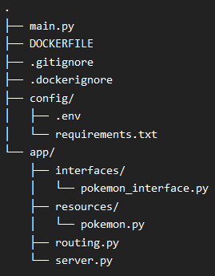
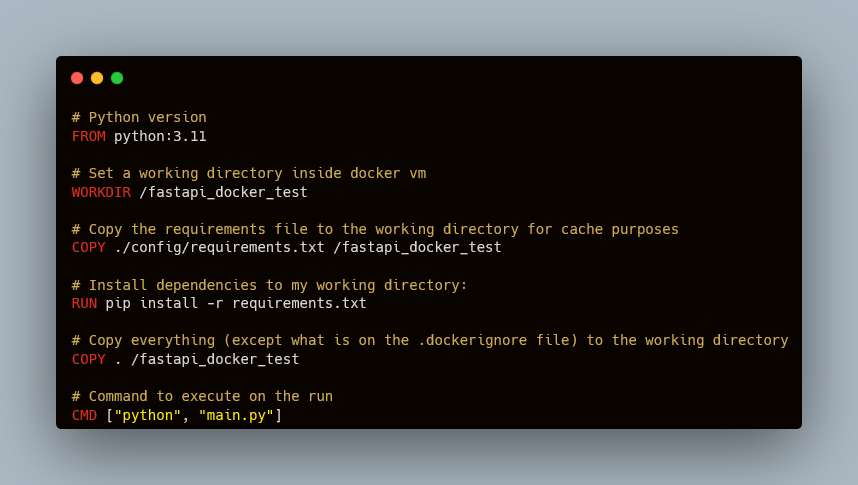
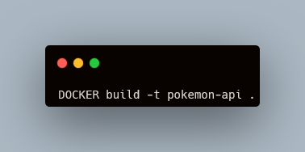
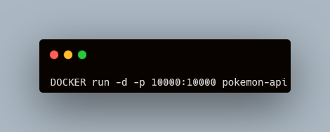

# A simple pokemon api with docker

## What is this project about?

This is the project that was used to study on how to create a simple Fastapi RESTful API with Docker and it´s components. (Docker compose was not used in this project)

## The api

The api was built using the micro-framework FastAPI as it is very fast to learn and run. If you want to learn how to use it, you can learn about it in it´s great documentation [here](https://fastapi.tiangolo.com/).

It was decided do use a free online Rest API called [PokeAPI](https://pokeapi.co/) as it is of very easy integration and about one of the most knonw franchises of the world (A favorite of mine) abd i also wanted to learn using it.

## Usage

The first component of the project is the API itself. The structure of the project can be seen below

For testing purposes, it was used a virtual environment to check the functionality of the api. For obvious reasons, the environment folder is not saved on github but it can be easily recreated with the requirements file

The only env variable used is the "TD_PORT" variable. You can set it to whatever port you have disponible. For this test it was used the port 10000. 
  * It was not necessary to set the env variables on the dockerfile because they are read by the python itself. If you want to use the dockerfile for this make the correct change.

The server host is recommended to be set to '0.0.0.0' since this value will be used within the docker environment and not the windows/linux/mac environment to connect with the other ips of the real machine.

## DOCKERFILE

This is the structure created on the dockerfile

To create the image from it you will need to run the following command in the terminal:

After the image has been built (it might take some minutes at the first time) you can run it with the next comand

Docker will return a process id after running the command (if you want to run on the terminal remove the "-d"). You can see the conteiner on the docker desktop app